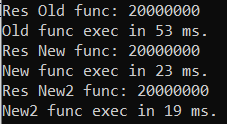

# laba5_os

Origianal code:
            var watch = System.Diagnostics.Stopwatch.StartNew();
            int[] a = new int[2];
            int res = 0;

            for (int j = 0; j < 10000000; j++)
            {
                a[0]++;
                a[0]++;
            }

            a[1] = a[0];

            Console.WriteLine($"Res Old func: {a[0]}");
            var elapsedMs = watch.ElapsedMilliseconds;
            Console.WriteLine($"Old func exec in {elapsedMs} ms.");

To optimize this code we can replace lines a[0]++ by a[0]+=2

First optimization code:
            var watch = System.Diagnostics.Stopwatch.StartNew();
            int[] a = new int[2];
            int res = 0;

            for (int j = 0; j < 10000000; j++)
            {
                a[0]+=2;
            }

            a[1] = a[0];
            watch.Stop();
            Console.WriteLine($"Res New func: {a[0]}");
            var elapsedMs = watch.ElapsedMilliseconds;
            Console.WriteLine($"New func exec in {elapsedMs} ms.");
            
And we can slightly increase performance by replace a[0]+=2 with res variables and assign value from res variable to array

Second optimization code:
            var watch = System.Diagnostics.Stopwatch.StartNew();
            int[] a = new int[2];
            int res = 0;

            for (int j = 0; j < 10000000; j++)
            {
                res += 2;
            }
            a[0] = a[1] = res;
            watch.Stop();
            Console.WriteLine($"Res New2 func: {a[0]}");
            var elapsedMs = watch.ElapsedMilliseconds;
            Console.WriteLine($"New2 func exec in {elapsedMs} ms.");
            
Results:

